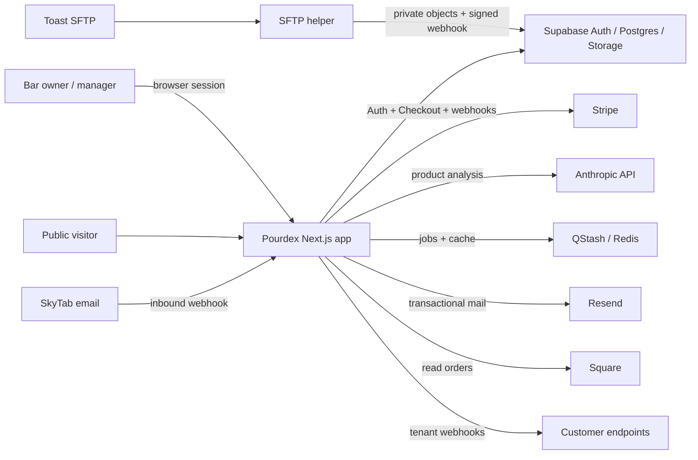
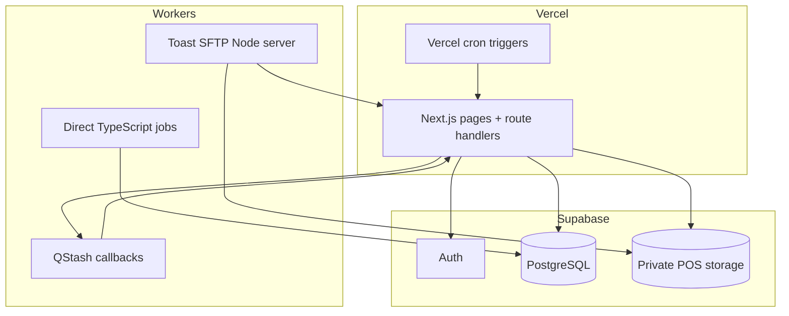
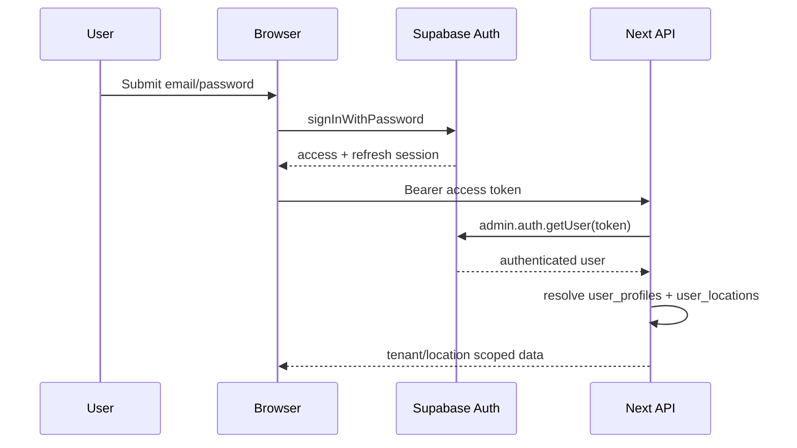
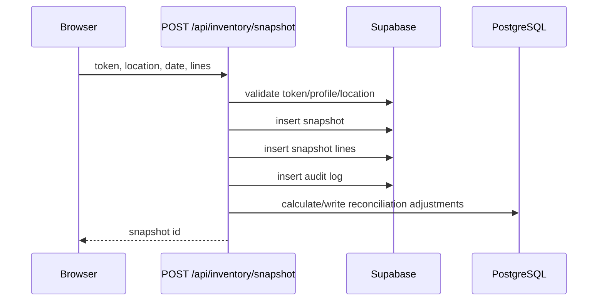
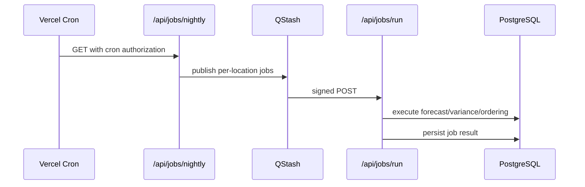
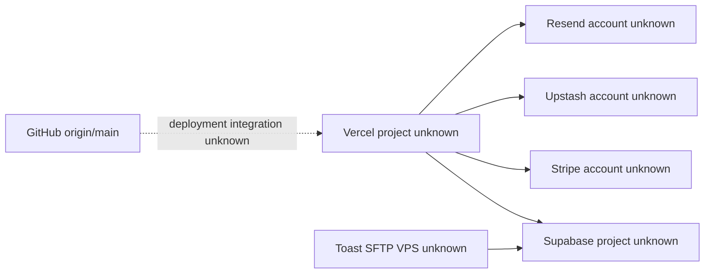

# System Architecture

## System context

Evidence: imports, environment references, route handlers, and configuration.
Confidence: confirmed. Impact if wrong: high. Validation: connector health and
platform inventory.

## Containers/processes

The application is a modular monolith plus external workers, not a
microservice system.

## Authentication flow

The authenticated page shell itself is client-enforced. API routes generally
authenticate server-side.

## Representative write path: inventory count

The snapshot and lines are not wrapped in a single transaction; a line insert
failure can leave an orphaned header. This is a pre-existing reliability risk.

## Background-job path

Direct scripts under `jobs/` bypass QStash and connect to `DATABASE_URL`.

## Deployment topology

Dashed/unknown edges are inference only. No production account, branch, region,
or project id is committed. Impact if wrong: high. Validation requires owner
platform review.
