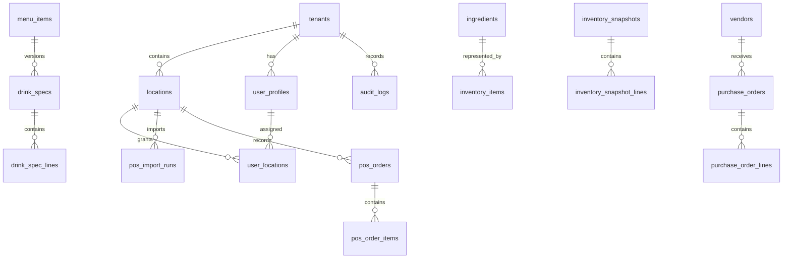

# Data Model and Data Flow

## Primary model

All core business tables use `tenant_id`; location-facing tables generally
also use `location_id`.

## Sources of truth

- Auth identity: Supabase Auth
- Tenant membership/role: `user_profiles`
- Location access: `user_locations`
- Billing entitlement: Supabase Auth `user_metadata.billing`
- Operational transactions: Supabase Postgres
- POS import blobs: private `pos-imports` Storage bucket
- Public/demo visualization: static fixtures in `src/lib/demo.ts`

## Migration ownership

Supabase SQL migrations are authoritative for the database. `src/lib/schema.ts`
contains only a subset and is behind later migrations (analytics additions,
webhooks, notification preferences, POS connections, job records). Drizzle
generation therefore cannot be treated as a complete schema source.

Confidence: confirmed. Impact if wrong: high. Validation: generated database
catalog comparison in a disposable environment.

## Sensitive data

- User email
- Vendor email/phone
- POS raw rows and order data
- Billing customer/subscription ids
- Webhook URLs and signing secrets
- Toast SFTP passwords
- Square access/refresh tokens
- Audit log actor/activity

Pre-existing schema stores connector/webhook secret material in readable
columns. Operations Center migrations will store only opaque secret references;
remediation of existing columns requires a separately rehearsed migration.

## Data risks

- Many foreign keys cascade from tenant deletion; no retention workflow is
  documented.
- Service-role route handlers bypass RLS, making route-level scoping critical.
- Later RLS policies for AI tables use a JWT app-metadata tenant key that
  repository code does not show being populated.
- `audit_logs.tenant_id` is non-null in SQL but AI logging accepts null,
  leading to swallowed audit failures.
- Webhook delivery response bodies may capture sensitive remote content.
- Stripe webhook processing lacks a provider-event idempotency table.
- Inventory snapshot multi-write flow is not transactional.
- POS connector secrets/tokens are not encrypted by application code despite
  comments implying encryption.

## Backup/restore and retention

No committed backup schedule, restore evidence, RPO/RTO, or retention policy
exists. Production backup/restore health is blocked pending owner/platform
evidence.
