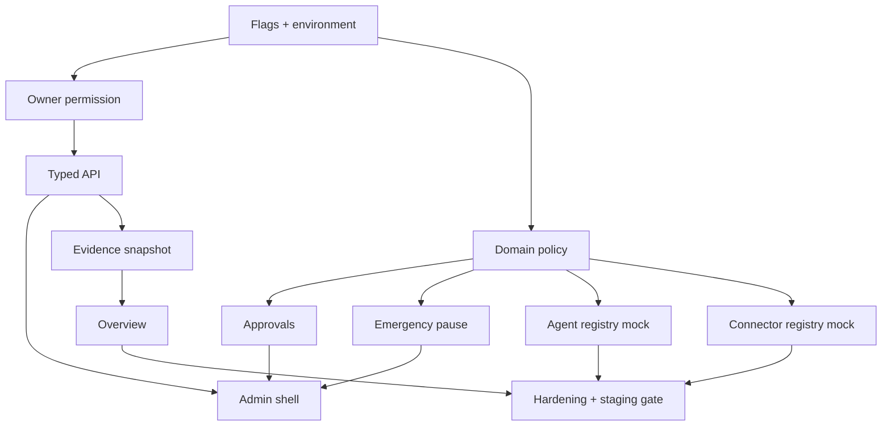

# Operations Center Integration Plan

## Architecture choice

Extend the existing modular monolith. Do not create a second app, login,
database, or deployment platform.

```text
src/operations/
  domain/       pure policy, scoring, state machines, schemas
  auth/         server-only permission and scope resolution
  data/         repository interfaces and Supabase adapters
  audit/        append-only event contract
  approvals/    exact payload policy and decisions
  agents/       definitions/prompts/evals/provider boundary
  connectors/   disabled/mock/read-only adapters
  orchestration/jobs, leases, retry contracts
  fixtures/     synthetic evidence and overview
  ui/           shared admin components

src/app/(authed)/operations/
  layout/page routes, lazy loaded

src/app/api/v1/operations/
  authenticated, owner-only route handlers
```

Names may be compacted but boundaries remain explicit.

## Exact native extension points

- Feature flags: extend `src/config/flags.ts` and root runtime flag payload.
- Auth/session: reuse Supabase token; add server-only guard using
  `user_profiles.role` and tenant membership.
- Navigation: conditionally add one entry in `EnterpriseShell` after permission
  discovery.
- UI: reuse `.enterprise-theme`, design tokens, cards, badges, focus styles.
- Data: additive Supabase migration and repository interfaces.
- Jobs: reuse QStash-compatible route style; keep disabled in production.
- Audit: extend existing audit concept with immutable Operations events.
- AI: new OpenAI server abstraction; existing Anthropic product AI untouched.

## Initial modules

1. Foundation: flags, environment, permission, typed errors
2. Domain: risk tiers, policy, approvals, score, state machines
3. Data: additive schema/adapters/fixtures
4. Admin shell: overview, approvals, agents, audit, policies, connectors
5. Evidence: repository snapshot manifest and freshness
6. Orchestration: schedules/leases/budgets in disabled/mock mode

## Feature flags

- `OPERATIONS_CENTER`
- `OPERATIONS_OVERVIEW`
- `OPERATIONS_APPROVALS`
- `OPERATIONS_AGENTS`
- `OPERATIONS_CONNECTORS`
- `OPERATIONS_EXECUTION`
- `OPERATIONS_EMERGENCY_PAUSE`

Defaults: false in every unknown/production environment. Read-only internal
foundation may run only when the master flag and permission pass.

## Migration approach

- Add new tables only.
- Native UUID/timestamptz/tenant conventions.
- No backfill required for the initial slice.
- RLS plus server guard.
- Application feature flag remains off before/after migration.
- Roll back by disabling flag; schema remains inert. Destructive rollback is
  not required.

## Issue graph



## Performance boundary

The Operations route is route-split by App Router. No Operations import belongs
in customer dashboard pages beyond the small permission/nav discovery. Heavy
aggregation and model work remain asynchronous.
